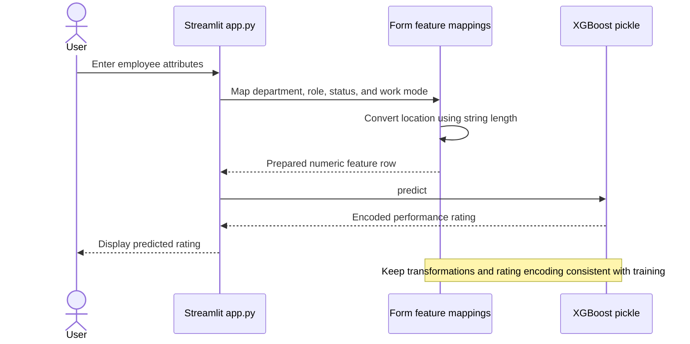

# Employee Performance Rating Prediction

An HR machine learning experiment with a Streamlit application that predicts an employee performance rating from employment attributes.

**Technology:** Python · XGBoost · NumPy · Streamlit

## Features

- Collect department, job title, location, experience, employment status, work mode, and salary in INR.
- Apply manually encoded inputs to the saved XGBoost model and display a rating.
- Compare classical models and dense neural networks in the notebook.

## Repository guide

| Path | Purpose |
|---|---|
| [app.py](app.py) | Employment input form and prediction display. |
| [employee-performance-prediction.ipynb](employee-performance-prediction.ipynb) | EDA, model comparison, and model export. |
| [xgb_employee_performance.pkl](xgb_employee_performance.pkl) | Saved classifier. |

## Requirements and current limitations

No dependency manifest is committed; the installation command covers the app's imports and the saved model's likely runtime dependencies. Match package versions to the original training environment if artifact loading fails.

The application uses manually defined category mappings and encodes location as string length. Verify these transformations against training before interpreting predictions. The notebook reads an external HR dataset from Kaggle. The displayed rating is a model demonstration, not an independently validated assessment of employee performance.

## UML diagrams

### Main workflow

The application uses its own category mappings and location-length transformation before calling the saved XGBoost model.



## Getting started

```bash
git clone https://github.com/IbrahimAbdelsattar/Employee-Performance-Rating-Prediction.git
cd Employee-Performance-Rating-Prediction
```

Use a Python virtual environment:

```bash
python -m venv .venv
```

Activate it with `source .venv/bin/activate` on macOS/Linux or `.venv\Scripts\Activate.ps1` in PowerShell.

```bash
python -m pip install streamlit numpy xgboost scikit-learn
python -m streamlit run app.py
```
