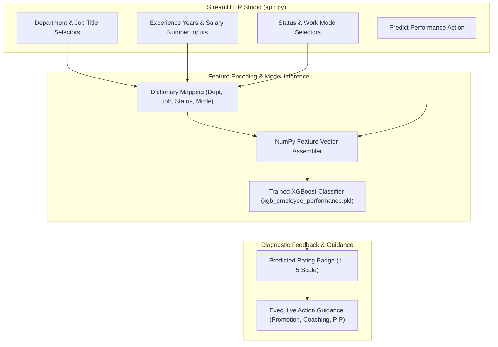

<br/><br/>

<!-- Animated Title -->
<p align="center">
  <a href="#">
    
  </a>
</p>

<p align="center">
  <b>Enterprise Machine Learning System for Employee Performance Rating & Workforce Productivity Forecasting</b><br/>
  <i>XGBoost Gradient Boosting · 29 Corporate Roles & 7 Departments · Compensation & Experience Modeling · Interactive Streamlit HR Studio</i>
</p>

<br/>

<!-- Badges Row 1: Core Technologies -->
<p align="center">
  
  
  
  
  
</p>

<!-- Badges Row 2: Standards & Status -->
<p align="center">
  
  
  
  
</p>

<br/>

<!-- Quick Navigation Bar -->
<p align="center">
  <a href="#-overview"></a>
  &nbsp;
  <a href="#-problem-statement--hr-solution"></a>
  &nbsp;
  <a href="#-workforce-dimensions"></a>
  &nbsp;
  <a href="#%EF%B8%8F-system-architecture"></a>
  &nbsp;
  <a href="#-performance-rating-scale"></a>
  &nbsp;
  <a href="#-quickstart--execution"></a>
</p>

---

## 📌 Overview

**Employee Performance Rating Prediction** is an AI-powered human capital intelligence platform engineered to objectively forecast employee performance ratings on a standardized scale from **1 to 5**. Designed for Chief Human Resources Officers (CHROs), people analytics teams, and organizational psychologists, the system models the multi-factorial relationships between compensation, years of professional experience, department dynamics, remote versus on-site modalities, and job titles.

Powered by an optimized **XGBoost** model serialized in `xgb_employee_performance.pkl`, the application mitigates subjective appraisal biases and delivers instant predictions accompanied by executive talent management recommendations inside an interactive **Streamlit Studio**.

```
                      ┌────────────────────────────────────────────────────────┐
                      │            Workforce Analytics Engine                  │
                      │                                                        │
[ Employee Profile:  ]┼──> [ Categorical & Experience Encoders ]               ├──> [ Performance Assessment ]
[ Role, Salary, Mode ]│             │                                          │    - Rating Score (1 to 5)
                      │             ▼                                          │    - Talent Tier Classification
                      │    [ Calibrated XGBoost Regressor ]                    │    - Executive HR Recommendations
                      │             │                                          │    - Promotion / Retention Guidance
                      │             ▼                                          │
                      │    [ Discrete Rating Formatter ] ──> Actionable Advice │
                      └────────────────────────────────────────────────────────┘
```

---

## 🎯 Problem Statement & HR Solution

<table>
<tr>
<td width="50%" valign="top">

### ❌ The Human Capital Evaluation Bias

Annual corporate performance reviews suffer from systemic flaws:

- 🎭 **Subjectivity & Recency Bias**: Managers frequently rate employees based on recent memory rather than longitudinal productivity.
- ⚖️ **Cross-Department Inconsistencies**: Strict grading in Engineering versus lenient grading in Sales produces skewed appraisal curves.
- 🚪 **Unanticipated Attrition**: High performers who feel unfairly rated or under-compensated quietly seek external offers.
- 📊 **Lack of Compensation Parity**: Difficulty identifying whether salary brackets align with expected tenure and output.

</td>
<td width="50%" valign="top">

### ✅ The Predictive Analytics Solution

| Challenge | Applied Engineering Solution |
| :--- | :--- |
| **Objective Benchmarks** | **XGBoost Decision Trees** provide data-grounded performance projections independent of individual managerial bias. |
| **Broad Role Coverage** | Models **29 distinct job titles** across **7 key enterprise departments**. |
| **Hybrid Work Modeling** | Accounts for performance differentials across **Remote** and **On-site** operating models. |
| **Interactive Simulation** | **Streamlit Studio** allows HR leaders to model "what-if" compensation adjustments and promotion readiness. |

</td>
</tr>
</table>

---

## 🔥 Workforce Dimensions

<table>
<tr>
<td width="33%" align="center" valign="top">

### 🏢 Department & Role
<br/>
<b>Organizational Hierarchy</b>
<p align="left">
• 7 Enterprise Departments (IT, Sales, Ops, Marketing, Finance, HR, R&D)<br/>
• 29 Granular job titles from Associate to C-Level (CTO, CFO, Director)<br/>
• Geographic location encoding<br/>
• Functional team dynamics
</p>

</td>
<td width="33%" align="center" valign="top">

### 💼 Career & Status
<br/>
<b>Professional Trajectory</b>
<p align="left">
• Experience span (0 to 40 years)<br/>
• Employment status (Active, Resigned, Retired, Terminated)<br/>
• Work mode (On-site vs Remote)<br/>
• Tenure progression curves
</p>

</td>
<td width="33%" align="center" valign="top">

### 💰 Compensation
<br/>
<b>Remuneration Structure</b>
<p align="left">
• Base salary modeling<br/>
• Compensation equity verification<br/>
• Impact on retention and rating<br/>
• Pay-for-performance alignment
</p>

</td>
</tr>
</table>

---

## 🏗️ System Architecture



---

## 🔬 Performance Rating Scale

The model projects performance on a standardized 5-point institutional rating matrix:

| Rating Tier | Evaluation Status | Recommended Executive HR Strategy |
| :---: | :--- | :--- |
| **5 / 5** | **Outstanding Performance** | High-potential leadership track, accelerated promotion, equity incentives. |
| **4 / 5** | **Exceeds Expectations** | Merit increase, stretch project assignments, departmental recognition. |
| **3 / 5** | **Meets Expectations** | Standard annual compensation adjustment, ongoing skills enablement. |
| **2 / 5** | **Needs Improvement** | Targeted upskilling, structured coaching plan, 90-day progress check. |
| **1 / 5** | **Unsatisfactory** | Performance Improvement Plan (PIP) or organizational reassignment. |

---

## ⚙️ Technical Stack

| Component | Technology | Purpose & Implementation |
| :--- | :--- | :--- |
| **Model Framework** | **XGBoost** | Gradient-boosted decision trees modeling non-linear career dynamics |
| **Language** | **Python 3.10+** | Core programming runtime |
| **Interactive UI** | **Streamlit** | Responsive two-column HR analytics portal |
| **Data Processing** | **Pandas & NumPy** | In-memory feature formatting and array reshaping |
| **Serialization** | **Pickle** | Serialized model storage (`xgb_employee_performance.pkl`) |

---

## 📁 Repository Structure

```
Employee-Performance-Rating-Prediction/
├── 📄 app.py                           # Interactive Streamlit HR prediction application
├── 📄 employee-performance-prediction.ipynb # Training, feature engineering & model notebook
├── 📄 xgb_employee_performance.pkl     # Serialized trained XGBoost model
├── 📁 .devcontainer/                   # Development container configuration
└── 📄 README.md                        # Documentation
```

---

## 🚀 Quickstart & Execution

### Prerequisites
- **Python**: 3.10 or higher
- **Virtual Environment**: Recommended

---

### 1. Installation

```bash
# 1. Clone repository
git clone https://github.com/IbrahimAbdelsattar/Employee-Performance-Rating-Prediction.git
cd Employee-Performance-Rating-Prediction

# 2. Create virtual environment
python -m venv venv
source venv/bin/activate        # On Windows: .\venv\Scripts\activate

# 3. Install dependencies
pip install streamlit xgboost scikit-learn pandas numpy
```

---

### 2. Running the HR Dashboard

```bash
streamlit run app.py
```

*The application will boot at `http://localhost:8501`. Enter employee role and compensation metrics to generate performance ratings.*

---

## 👥 Author & Connect

**Ibrahim Abdelsattar**  
*AI Engineer & Machine Learning Specialist*

- 🌐 **GitHub**: [@IbrahimAbdelsattar](https://github.com/IbrahimAbdelsattar)
- 💼 **LinkedIn**: [Ibrahim Abdelsattar](https://www.linkedin.com/in/ibrahim-abdelsattar/)
- 📧 **Email**: [ibrahimabdelsattar042@gmail.com](mailto:ibrahimabdelsattar042@gmail.com)

---

<p align="center">
  <sub>Engineered for people analytics, organizational excellence, and objective talent management. © 2026 Employee Performance Rating.</sub>
</p>
